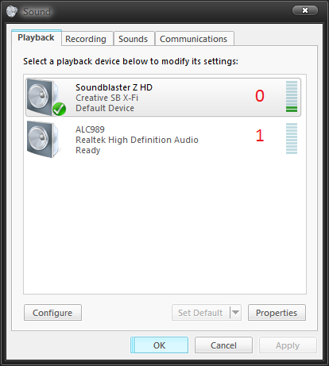

Headphone Speaker Switcher
==========================

Rainmeter skin used to switch between headphones / speakers. Works in Windows 7.

The AudiosourceSwitcher.exe is based on code from this repo: [justinryder/AudioEndPointController](https://github.com/justinryder/AudioEndPointController).


AudiosourceSwitcher.exe
-----------------------

```
AudiosourceSwitcher.exe [audio device to switch to]

AudiosourceSwitcher.exe         <-- switches to number 0
AudiosourceSwitcher.exe 0       <-- switches to number 0
AudiosourceSwitcher.exe 1       <-- switches to number 1
```

